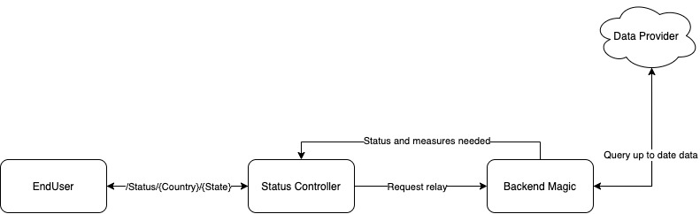

# COVID-19 Alert Microservice with Spring Boot

A Spring Boot microservice to provide alerts based on location.

# Current Implementation

The current implementation allows providing a ```country``` name, a ```state``` name and a specific ```date```. The
returned result, will be a measures recommendation based on the current number of new cases in that region.

- Port: 9090
- Endpoint: ```/status/```
- Request: GET
- Path variables: ```/{country}/{state}/{YYYY-MM-DD}/ ```

#### Usage example

http://localhost:9090/status/Germany/Berlin

# Data source

The main source API for this implementation will be https://covid19tracking.narrativa.com/index_en.html  
Documentation is available
at https://documenter.getpostman.com/view/10831675/SzYZ1eNY#9741ae31-6493-4d32-aec3-a272e4bcec67

## API use example

```bash 
https://api.covid19tracking.narrativa.com/api/2020-11-07/country/egypt/region/cairo
```

# Basic Microservice Architecture



# Dependencies

- Spring boot
- JSONiJ for parsing json
    - https://bitbucket.org/jmarsden/jsonij/wiki/Home
    - To get the version needed
        - Go to: https://jar-download.com/artifacts/cc.plural/jsonij/0.5.2
        - Search needed version
        - Click ```</>show build tool code```
        - Click ```Gradle```
    - gradle dependencies
      ```
      dependencies {
          compile group: 'cc.plural', name: 'jsonij', version: '0.5.2'
          ...
        }
      ```
    - Basic usage
      ```java
        import jsonij.Value;
        import jsonij.parser.JSONParser;
        import jsonij.parser.ParserException;
        
        public class json {
            public static void main(String[] arg){
                // Create a new parser object
                JSONParser parser = new JSONParser();
                // Mock a jason response from a REST endpoint
                String JsonResponse = "{\"key\":[{\"imdKey\":55},1,2.3,0.4,-5,-5.92,0.001E1,-0.045E45,987654321], \"key2\":{\"key21\":1,\"key22\":2}}";
                // Parse the response
                Value jsonBody = parser.parse(JsonResponse);
                // Extract a nested value
                Value nestedValue = jsonBody.get("key").get(0).get("imdKey");
                // Type case the response to string
                String stringValue = String.valueOf(jsonBody);
                // Print the values.  Note: you can use/print the value directly.
                System.out.println("The raw response value is " + stringValue + "\nThe nested value extracted is " + nestedValue);
            }
        }
      ```

# Setup logging

In order to the level correctly, take the path from the ```root``` and use ```.``` as a separator till you reach the
package name.  
Levels:
``` TRACE, DEBUG, INFO, WARN, ERROR, FATAL, OFF``` .

In the ```application.yaml``` file add the following:

```yaml
logging:
  level:
    com.nexthink.mnt.covidalertservice.service: DEBUG
```